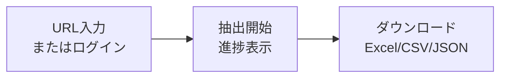

# SUUMO 物件情報スクレイピングツール

SUUMOの賃貸物件URLから詳細情報を自動抽出し、Excel/CSV/JSON形式でエクスポートするWebツール。

---

## なぜ作ったか（Why）

| 課題 | 解決 |
|-----|------|
| 複数物件の情報を手動で比較するのは手間がかかる | URLを入力するだけで自動でデータ収集 |
| お気に入り物件を一括で管理したい | SUUMOログインでお気に入りを一括取得 |
| Excel以外の形式でも出力したい | Excel/CSV/JSON 3形式に対応 |

---

## 何ができるか（What）

### 主な機能

1. **物件情報の自動抽出**
   - SUUMOの物件URLを入力するだけで詳細情報を取得
   - 複数URLの一括処理に対応

2. **お気に入り一括取得**
   - SUUMOアカウントでログイン
   - 保存済みのお気に入り物件を自動取得

3. **複数フォーマットでエクスポート**
   - Excel (.xlsx)
   - CSV (.csv)
   - JSON (.json)

4. **リアルタイム進捗表示**
   - 処理状況をプログレスバーで確認

---

## 使い方（How）

### クイックスタート

```bash
# 1. リポジトリをクローン
git clone <repository-url>
cd Project_Suumo

# 2. 仮想環境をセットアップ
python -m venv .venv
source .venv/bin/activate  # macOS/Linux
# .venv\Scripts\activate   # Windows

# 3. 依存関係をインストール
pip install -r requirements.txt

# 4. アプリを起動
python run.py
```

ブラウザで http://localhost:5001 にアクセス

### 使い方の流れ



---

## 取得できる情報（Result）

| カテゴリ | 取得項目 |
|---------|---------|
| **基本情報** | 物件名、所在地 |
| **費用** | 賃料、管理費・共益費、敷金、礼金、保証金、敷引・償却 |
| **物件詳細** | 間取り、専有面積、向き、建物種別、築年数 |
| **アクセス** | 最寄り駅（最大3つ）、徒歩時間 |
| **その他** | 損保、駐車場、仲介手数料、保証会社、ほか初期費用、備考 |

---

## ディレクトリ構成

```
Project_Suumo/
├── app/                    # Flaskアプリケーション
│   ├── scraper/            # スクレイピングモジュール
│   ├── exporters/          # エクスポートモジュール
│   ├── templates/          # HTMLテンプレート
│   └── static/             # CSS/JS
├── legacy/                 # 旧コード（Flet版）
├── config.py               # 設定ファイル
├── run.py                  # エントリーポイント
└── requirements.txt        # 依存関係
```

---

## 技術スタック

| 領域 | 技術 |
|-----|------|
| Backend | Flask 3.x, Python 3.11+ |
| Frontend | Bootstrap 5, Vanilla JavaScript |
| スクレイピング | BeautifulSoup4, Requests |
| データ出力 | pandas, openpyxl |
| 認証 | Selenium, webdriver-manager |

---

## 注意事項

- **スクレイピングマナー**: サーバー負荷軽減のため、各URL処理間に2秒の待機時間を設けています
- **HTML構造変更**: SUUMOのHTML構造が変更された場合、セレクタの更新が必要になる可能性があります
- **お気に入り取得**: ChromeブラウザとChromeDriverが必要です
- **利用目的**: 個人的な使用を目的としています。商用利用は意図していません

---

## ライセンス

MIT License
